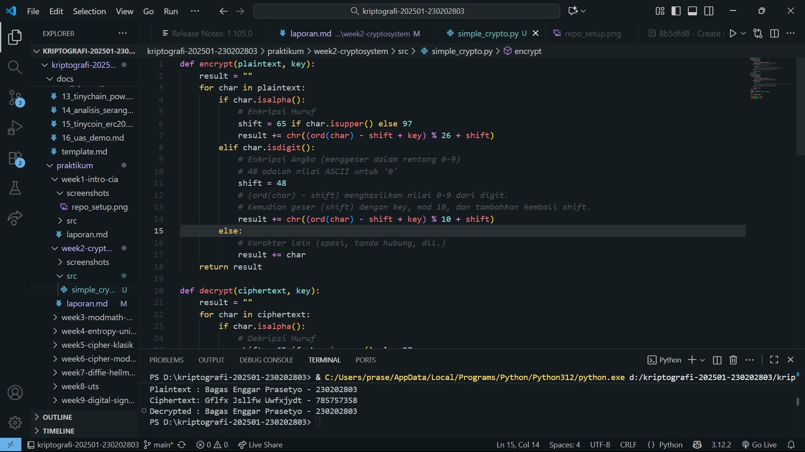
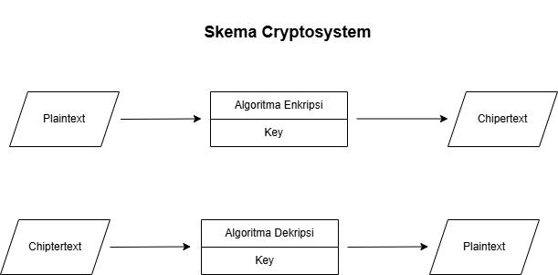

# Laporan Praktikum Kriptografi
Minggu ke-: 2 
Topik: [Cryptosystem (Komponen, Enkripsi & Dekripsi, Simetris & Asimetris)]  
Nama: [Bagas Enggar Prasetyo]  
NIM: [230202803]  
Kelas: [5IKRB]  

---

## 1. Tujuan
1. Mengidentifikasi komponen dasar kriptosistem (plaintext, ciphertext, kunci, algoritma).
2. Menggambarkan proses enkripsi dan dekripsi sederhana.
3. Mengklasifikasikan jenis kriptosistem (simetris dan asimetris)

---

## 2. Dasar Teori

Definisi cipher klasik
Cipher klasik (atau kriptografi klasik) adalah metode penyandian pesan yang digunakan sebelum era komputer modern, di mana proses enkripsi dan dekripsi dilakukan secara manual atau dengan bantuan alat sederhana (seperti roda cipher atau mesin Enigma).

Secara umum, cipher klasik bekerja dengan mengubah huruf-huruf dalam teks asli (plaintext) menjadi huruf-huruf lain (ciphertext) berdasarkan aturan tertentu. Aturan ini biasanya melibatkan pergeseran huruf, substitusi, atau transposisi.

Salah satu contoh dari cipher klasik adalah Caesar Cipher. Cara penerapannya yaitu setiap huruf digeser beberapa posisi dalam alfabet. Contoh: geser 3 huruf → A → D, B → E. Maka, jika plaintext-nya "HELLO" maka jika dienkripsi menggunakan Caesar Cipher menjadi "KHOOR".

---

## 3. Alat dan Bahan
(- Python 3.12  
- Visual Studio Code  
- Git dan akun GitHub  
- Library tambahan (misalnya pycryptodome, jika diperlukan)  )

---

## 4. Langkah Percobaan
(Tuliskan langkah yang dilakukan sesuai instruksi.  
Contoh format:
1. Membuat file `simple_crypto.py` di folder `praktikum/week2-cryptosystem/src/`.
2. Menyalin kode program dari panduan praktikum.
3. Menjalankan program dengan perintah `python simple_crypto.py`.)
4. Memodifikasi program supaya angka juga bisa ikut ter-enkripsi dengan cara menambahkan baris 
            elif char.isdigit():
            # Enkripsi Angka (menggeser dalam rentang 0-9)
            # 48 adalah nilai ASCII untuk '0'
            shift = 48
            # (ord(char) - shift) menghasilkan nilai 0-9 dari digit.
            # Kemudian geser (shift) dengan key, mod 10, dan tambahkan kembali shift.
            result += chr((ord(char) - shift + key) % 10 + shift)
        else:
            # Karakter lain (spasi, tanda hubung, dll.)
            result += char
)

---

## 5. Source Code

```
def encrypt(plaintext, key):
    result = ""
    for char in plaintext:
        if char.isalpha():
            # Enkripsi Huruf
            shift = 65 if char.isupper() else 97
            result += chr((ord(char) - shift + key) % 26 + shift)
        elif char.isdigit():
            # Enkripsi Angka (menggeser dalam rentang 0-9)
            # 48 adalah nilai ASCII untuk '0'
            shift = 48
            # (ord(char) - shift) menghasilkan nilai 0-9 dari digit.
            # Kemudian geser (shift) dengan key, mod 10, dan tambahkan kembali shift.
            result += chr((ord(char) - shift + key) % 10 + shift)
        else:
            # Karakter lain (spasi, tanda hubung, dll.)
            result += char
    return result

def decrypt(ciphertext, key):
    result = ""
    for char in ciphertext:
        if char.isalpha():
            # Dekripsi Huruf
            shift = 65 if char.isupper() else 97
            # Untuk dekripsi, kita kurangi key, kemudian mod 26
            result += chr((ord(char) - shift - key) % 26 + shift)
        elif char.isdigit():
            # Dekripsi Angka
            shift = 48
            # Untuk dekripsi, kita kurangi key, kemudian mod 10
            # Penting: Di Python, operasi modulo (%) dengan angka negatif akan bekerja dengan benar
            # untuk "membungkus" kembali ke angka positif.
            result += chr((ord(char) - shift - key) % 10 + shift)
        else:
            # Karakter lain
            result += char
    return result

if __name__ == "__main__":
    message = "Bagas Enggar Prasetyo - 230202803"
    key = 5

    enc = encrypt(message, key)
    dec = decrypt(enc, key)

    print("Plaintext :", message)
    print("Ciphertext:", enc)
    print("Decrypted :", dec)

```


---

## 6. Hasil dan Pembahasan
Hasil dari program yang diberikan dari github menunjukan bahwa enkripsi yang digunakan adalah caesar chiper dengan hasil enkripsi hanya teks berupa huruf saja yang terenkripsi sedangkan angka tidak terenkripsi, lalu saya modifikasi programnya dengan menambahkan baris :
         elif char.isdigit():
            # Enkripsi Angka (menggeser dalam rentang 0-9)
            # 48 adalah nilai ASCII untuk '0'
            shift = 48
            # (ord(char) - shift) menghasilkan nilai 0-9 dari digit.
            # Kemudian geser (shift) dengan key, mod 10, dan tambahkan kembali shift.
            result += chr((ord(char) - shift + key) % 10 + shift)
dengan menambahkan baris tersebut maka sekarang karakter angka pun menjadi ikut terenkripsi juga. Berikut adalah hasil code yang sudah dimodifikasi dan hasil eksekusinya

Hasil eksekusi program Caesar Cipher:





---

## 7. Jawaban Pertanyaan

# Perbedaan Kriptografi Simeteris dan Asimetris
1. Kriptografi simetris adalah sistem enkripsi yang menggunakan satu kunci yang sama untuk enkripsi (menyandikan) dan dekripsi (membuka) pesan. Artinya, pengirim dan penerima harus memiliki kunci yang sama dan menjaganya agar tetap rahasia.

+Kelebihan : - Proses enkripsi dan dekripsi lebih cepat.
             -Efisien untuk data dalam jumlah besar.
+Kekurangan : -Distribusi kunci sulit, karena kunci harus dikirim secara aman ke penerima.
              -Jika kunci bocor, semua pesan bisa terbaca.

+Contoh Algoritma Simetris :
1. AES (Advanced Encryption Standard):Menggunakan blok 128-bit dengan panjang kunci 128, 192, atau 256 bit. Sangat aman dan menjadi standar internasional.

2. DES (Data Encryption Standard): Menggunakan blok 64-bit dan kunci 56-bit.Kini dianggap kurang aman karena panjang kuncinya terlalu pendek.

2. Kriptografi asimetris menggunakan dua kunci berbeda tetapi saling berhubungan, yaitu:
+Kunci publik (public key) → digunakan untuk enkripsi
+Kunci privat (private key) → digunakan untuk dekripsi
Kunci publik dapat dibagikan secara bebas, sedangkan kunci privat harus dijaga kerahasiaannya.

+Kelebihan : - Keamanan distribusi kunci lebih baik, karena kunci publik boleh diketahui siapa pun.
             -Mendukung tanda tangan digital dan autentikasi identitas.
+Kekurangan : - Proses enkripsi dan dekripsi lebih lambat dibanding sistem simetris.
              -Kompleksitas komputasi tinggi.

Contoh Algoritma Asimetris :
1. RSA (Rivest–Shamir–Adleman): Berdasarkan prinsip faktorisasi bilangan prima besar.Digunakan untuk enkripsi data dan tanda tangan digital.

2. ECC (Elliptic Curve Cryptography):Berdasarkan kurva eliptik matematis. Menawarkan keamanan tinggi dengan ukuran kunci lebih kecil dibanding RSA.

# Pertanyaan dan Jawaban Soal
1. Sebutkan komponen utama dalam sebuah kriptosistem.
+Plaintext-Merupakan pesan asli atau data awal yang ingin dilindungi.
+Ciphertext-Hasil dari proses enkripsi terhadap plaintext.
+Key-Nilai atau informasi rahasia yang digunakan dalam proses enkripsi dan dekripsi.
+Algoritma Enkripsi-Aturan atau prosedur matematika yang digunakan untuk mengubah plaintext menjadi ciphertext dengan bantuan kunci.
+Algoritma Dekripsi-Digunakan untuk mengembalikan ciphertext menjadi plaintext dengan kunci yang sesuai.

2. Apa kelebihan dan kelemahan sistem simetris dibandingkan asimetris?
Simetris menggunakan satu kunci yang sama untuk enkripsi dan dekripsi, sehingga prosesnya lebih cepat dan efisien, tetapi berisiko tinggi dalam distribusi kunci karena harus dijaga kerahasiaannya. Sedangkan, Asimetris menggunakan dua kunci berbeda (publik dan privat), membuat sistem lebih aman dalam pertukaran kunci dan mendukung autentikasi, namun lebih lambat dan komputasinya lebih kompleks.

3. Mengapa distribusi kunci menjadi masalah utama dalam kriptografi simetris?
Distribusi kunci menjadi masalah utama dalam kriptografi simetris karena tidak ada cara aman bawaan untuk membagikan kunci rahasia, sehingga berisiko disadap atau bocor selama pengiriman. Tanpa distribusi kunci yang aman, seluruh sistem menjadi tidak aman.

---

## 8. Kesimpulan
Berdasarkan percobaan diatas penggunaan caesar chiper hanya bisa untuk karakter huruf saja, dan perlu adanya modifikasi pada kode pemrograman agar bisa mengolah karakter angka. Selain itu, perbedaan dari sistem simetris dan asimetris memiliki kelebihan dan kekurangannya masing-masing.

---

## 9. Daftar Pustaka

---

## 10. Commit Log
(Tuliskan bukti commit Git yang relevan.  
Contoh:
```
commit week2-cryptosystem
Author: Bagas Enggar Prasetyo <bagasenggarp42@gmail.com>
Date:   2025-10-14

    week2-cryptosystem: implementasi Caesar Cipher dan laporan )
```
