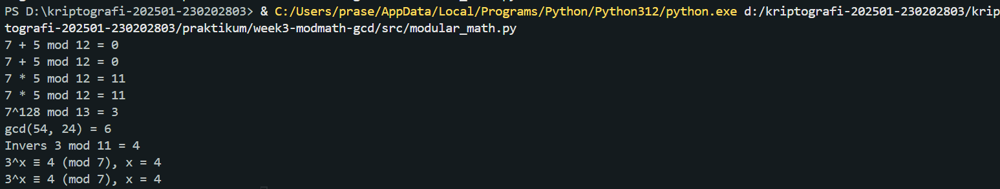

# Laporan Praktikum Kriptografi
Minggu ke-: 3 
Topik: [Modular Math (Aritmetika Modular, GCD, Bilangan Prima, Logaritma Diskrit)]  
Nama: [Bagas Enggar Prasetyo]  
NIM: [230202803]  
Kelas: [5IKRB]  

---

## 1. Tujuan

1. Menyelesaikan operasi aritmetika modular.
2. Menentukan bilangan prima dan menghitung GCD (Greatest Common Divisor).
3. Menerapkan logaritma diskrit sederhana dalam simulasi kriptografi.

---

## 2. Dasar Teori

Modular Arithmetic atau aritmetika modulo adalah cabang matematika yang berfokus pada operasi bilangan dengan sisa hasil pembagian. Dalam sistem ini, dua bilangan dianggap kongruen jika memiliki sisa pembagian yang sama terhadap suatu bilangan tertentu (modulus). Secara formal ditulis sebagai:

a≡b(modn)

yang berarti bahwa (a−b) habis dibagi oleh 𝑛 Aritmetika modulo sering digunakan dalam bidang kriptografi, algoritma komputer, teori bilangan, dan keamanan digital, karena kemampuannya menjaga hasil operasi tetap dalam rentang nilai yang terbatas. Operasi dasar seperti penjumlahan, pengurangan, dan perkalian dalam sistem ini dilakukan dengan mengambil sisa hasil bagi terhadap modulus, misalnya (a+b)mod n, (a−b)mod n, dan (a×b)mod n.

Greatest Common Divisor (GCD) atau faktor persekutuan terbesar adalah bilangan bulat positif terbesar yang dapat membagi habis dua bilangan tanpa sisa. Misalnya, GCD dari 18 dan 24 adalah 6. GCD sangat penting dalam berbagai algoritma komputasi, seperti algoritma Euclidean, yang digunakan untuk menghitung GCD secara efisien dengan prinsip bahwa GCD(a,b) = GCD(b,a mod b). Konsep GCD juga berperan dalam kriptografi kunci publik (seperti RSA) dan dalam mencari invers modular, yaitu bilangan 𝑥 yang memenuhi a × x ≡ 1(mod n).

Secara keseluruhan, modular arithmetic dan GCD merupakan fondasi penting dalam teori bilangan dan komputasi modern karena mendukung operasi matematis yang aman, efisien, dan terkontrol dalam berbagai sistem digital.

---

## 3. Alat dan Bahan
(- Python 3.12 
- Visual Studio Code / editor lain  
- Git dan akun GitHub  
- Library tambahan (misalnya pycryptodome, jika diperlukan)  )

---

## 4. Langkah Percobaan
(Tuliskan langkah yang dilakukan sesuai instruksi.  
Contoh format:
1. Membuat file `modular_math.py` di folder `praktikum/week3-modmath/src/modular_math.py`.
2. Menyalin kode program dari panduan praktikum.
3. Menjalankan program dengan perintah `python modular_math.py`.)
4. Screenshot hasil program dan di taruh ke dalam folder `praktikum/week3-modmath-gcd/screenshots/hasil.png`

---

## 5. Source Code

```
def mod_add(a, b, n): return (a + b) % n
def mod_sub(a, b, n): return (a - b) % n
def mod_mul(a, b, n): return (a * b) % n
def mod_exp(base, exp, n): return pow(base, exp, n)  # eksponensiasi modular

print("7 + 5 mod 12 =", mod_add(7, 5, 12))
print("7 * 5 mod 12 =", mod_mul(7, 5, 12))
print("7^128 mod 13 =", mod_exp(7, 128, 13))

def gcd(a, b):
    while b != 0:
        a, b = b, a % b
    return a

print("gcd(54, 24) =", gcd(54, 24))

def egcd(a, b):
    if a == 0:
        return b, 0, 1
    g, x1, y1 = egcd(b % a, a)
    return g, y1 - (b // a) * x1, x1

def modinv(a, n):
    g, x, _ = egcd(a, n)
    if g != 1:
        return None
    return x % n

print("Invers 3 mod 11 =", modinv(3, 11))

def discrete_log(a, b, n):
    for x in range(n):
        if pow(a, x, n) == b:
            return x
    return None

print("3^x ≡ 4 (mod 7), x =", discrete_log(3, 4, 7))
```

---

## 6. Hasil dan Pembahasan



---

## 7. Jawaban Pertanyaan
(Jawab pertanyaan diskusi yang diberikan pada modul.  
- Pertanyaan 1: Peran aritmetika modular dalam kriptografi modern adalah sebagai dasar untuk menjaga keamanan proses enkripsi dan dekripsi data. Operasi seperti perkalian, eksponensial, dan pembagian dilakukan dalam ruang modular agar hasilnya tetap berada dalam rentang tertentu dan sulit untuk dibalik tanpa kunci rahasia. Contohnya, dalam algoritma RSA dan Diffie–Hellman, aritmetika modular memastikan bahwa meskipun nilai publik diketahui, kunci privat tetap sulit dihitung karena sifat matematis modulo yang kompleks.  
- Pertanyaan 2: Invers modular penting dalam algoritma kunci publik seperti RSA karena digunakan untuk menghitung kunci dekripsi dari kunci enkripsi. Dalam RSA, kunci privat 𝑑 adalah invers modular dari kunci publik 𝑒 terhadap fungsi totien 𝜙(𝑛), yaitu 𝑒 × 𝑑 ≡ 1 (mod𝜙(𝑛)). Tanpa invers modular, proses dekripsi tidak bisa dilakukan dengan benar karena tidak akan ada pasangan kunci yang saling membatalkan operasi enkripsi dan dekripsi dalam sistem modular.
- Pertanyaan 3: Tantangan utama dalam menyelesaikan logaritma diskrit untuk modulus besar adalah tingginya kompleksitas komputasi. Tidak ada algoritma efisien yang dapat menyelesaikan logaritma diskrit dalam waktu singkat untuk bilangan besar, terutama ketika modulus berupa bilangan prima dengan panjang ratusan atau ribuan bit. Inilah yang menjadi dasar kekuatan keamanan algoritma seperti Diffie–Hellman dan ElGamal, karena menghitung logaritma diskrit dengan modulus besar secara praktis hampir mustahil dilakukan dengan teknologi komputasi saat ini.
---

## 8. Kesimpulan
Aritmetika modular merupakan fondasi utama dalam kriptografi modern karena menyediakan struktur matematis yang memungkinkan terciptanya sistem keamanan digital yang kuat dan efisien. Konsep invers modular memainkan peran penting dalam menjaga hubungan antara kunci publik dan kunci privat pada algoritma seperti RSA, memastikan hanya pihak yang berwenang yang dapat melakukan dekripsi atau penandatanganan digital. Sementara itu, kesulitan dalam menyelesaikan logaritma diskrit untuk modulus besar menjadi salah satu pilar keamanan utama bagi berbagai sistem kriptografi, karena hingga kini belum ditemukan metode komputasi yang efisien untuk memecahkannya. Dengan demikian, kombinasi dari aritmetika modular, invers modular, dan kompleksitas logaritma diskrit membentuk dasar matematis yang kokoh bagi keamanan komunikasi dan pertukaran data di era digital modern.

---

## 9. Daftar Pustaka

---

## 10. Commit Log
(Tuliskan bukti commit Git yang relevan.  
Contoh:
```
commit week3-modmath-gcd
Author: Bagas Enggar Prasetyo <bagasenggarp42@gmail.com>
Date:   2025-10-26

    week3-modmath: (Aritmetika Modular, GCD, Bilangan Prima, Logaritma Diskrit) )
```
