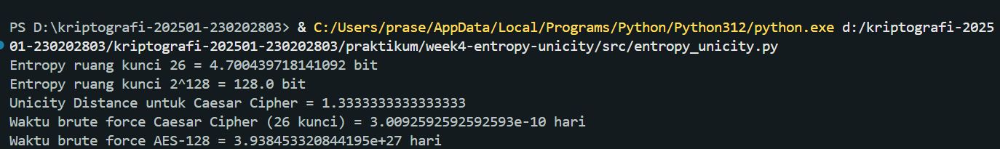

# Laporan Praktikum Kriptografi
Minggu ke-: 4
Topik: [Entropy & Unicity Distance (Evaluasi Kekuatan Kunci dan Brute Force)]  
Nama: [Bagas Enggar Prasetyo]  
NIM: [230202803]  
Kelas: [5IKRB]  

---

## 1. Tujuan
- Menyelesaikan perhitungan sederhana terkait entropi kunci.
- Menggunakan teorema Euler pada contoh perhitungan modular & invers.
- Menghitung unicity distance untuk ciphertext tertentu.
- Menganalisis kekuatan kunci berdasarkan entropi dan unicity distance.
- Mengevaluasi potensi serangan brute force pada kriptosistem sederhana.

---

## 2. Dasar Teori
Entropi dalam kriptografi merupakan ukuran tingkat ketidakpastian atau kerandoman dalam suatu sistem, khususnya pada kunci atau data yang dienkripsi. Semakin tinggi entropi, semakin sulit bagi penyerang untuk menebak atau memprediksi kunci, karena jumlah kemungkinan kombinasi semakin besar. Entropi dihitung dalam satuan bit, dan sistem yang aman harus menghasilkan nilai entropi mendekati acak untuk menghindari pola yang dapat dieksploitasi dalam proses pembobolan.

Sementara itu, Unicity Distance adalah ukuran teoretis yang menunjukkan jumlah minimum ciphertext yang diperlukan agar hanya terdapat satu kemungkinan plaintext yang konsisten dengan ciphertext tersebut, dengan asumsi penyerang memiliki kemampuan komputasi tak terbatas. Nilai Unicity Distance dipengaruhi oleh entropi kunci dan tingkat redundansi data; semakin panjang dan acak kunci serta semakin sedikit redundansi informasi pada pesan, maka semakin tinggi nilai Unicity Distance yang menunjukkan sistem kriptografi lebih sulit dipecahkan. Dengan demikian, entropi berperan dalam menentukan kerandoman kunci, sedangkan Unicity Distance menunjukkan seberapa banyak data terenkripsi yang diperlukan untuk memecahkan cipher secara teoretis.

---

## 3. Alat dan Bahan
(- Python 3.12
- Visual Studio Code / editor lain  
- Git dan akun GitHub  
- Library tambahan (misalnya pycryptodome, jika diperlukan)  )

---

## 4. Langkah Percobaan
Tuliskan langkah yang dilakukan sesuai instruksi.  
1. Membuat file `entropy_unicity.py` di folder `praktikum/week4-entropy-unicity/src/entropy_unicity.py`.
2. Menyalin kode program dari panduan praktikum.
3. Menjalankan program dengan perintah `python entropy_unicity.py`.
4. Screenshot hasil dari program dan memasukan ke dalam folder screenshots `praktikum/week4-entropy-unicity/screenshots/hasil.png`.

---

## 5. Source Code

```python
import math

def entropy(keyspace_size):
    return math.log2(keyspace_size)

print("Entropy ruang kunci 26 =", entropy(26), "bit")
print("Entropy ruang kunci 2^128 =", entropy(2**128), "bit")

def unicity_distance(HK, R=0.75, A=26):
    return HK / (R * math.log2(A))

HK = entropy(26)
print("Unicity Distance untuk Caesar Cipher =", unicity_distance(HK))

def brute_force_time(keyspace_size, attempts_per_second=1e6):
    seconds = keyspace_size / attempts_per_second
    days = seconds / (3600*24)
    return days

print("Waktu brute force Caesar Cipher (26 kunci) =", brute_force_time(26), "hari")
print("Waktu brute force AES-128 =", brute_force_time(2**128), "hari")
```

---

## 6. Hasil dan Pembahasan




---

## 7. Jawaban Pertanyaan
  
- Pertanyaan 1: Nilai entropy dalam konteks kekuatan kunci menggambarkan seberapa acak dan sulit ditebak suatu kunci. Semakin tinggi entropinya, semakin besar ruang kemungkinan yang harus ditebak oleh penyerang. Artinya, kunci dengan entropy tinggi lebih kuat karena tidak mudah diprediksi atau ditebak melalui pola tertentu.
- Pertanyaan 2: Unicity distance penting karena menunjukkan seberapa banyak ciphertext yang diperlukan untuk bisa memastikan hanya ada satu plaintext yang benar. Jika jumlah ciphertext yang didapat penyerang belum mencapai unicity distance, maka masih ada banyak kemungkinan plaintext yang cocok sehingga cipher tetap aman. Semakin besar nilai unicity distance, semakin sulit sebuah cipher dipecahkan meskipun data terenkripsi bocor dalam jumlah tertentu.
- Pertanyaan 3: Brute force tetap menjadi ancaman meskipun algoritma kriptografi sudah kuat, karena metode ini tidak mencari kelemahan algoritma, melainkan mencoba semua kemungkinan kunci satu per satu. Jika kunci terlalu pendek atau dibuat dengan pola yang lemah, brute force tetap bisa berhasil. Selain itu, perkembangan teknologi komputasi, termasuk potensi komputasi kuantum. Membuat brute force selalu perlu dipertimbangkan sebagai ancaman nyata.

---

## 8. Kesimpulan
Entropi dalam kriptografi adalah ukuran tingkat kerandoman atau ketidakpastian suatu kunci, yang menentukan seberapa sulit kunci tersebut ditebak. Semakin tinggi entropinya, semakin aman sistem karena kunci lebih acak dan sulit diprediksi. Sementara itu, unicity distance menunjukkan jumlah minimum ciphertext yang diperlukan agar suatu cipher dapat dipecahkan secara unik; semakin besar nilainya, semakin kuat keamanan cipher karena dibutuhkan lebih banyak data untuk menemukan kunci yang benar. Kedua konsep ini saling berkaitan entropi yang tinggi meningkatkan unicity distance dan memperkuat sistem enkripsi. Meskipun begitu, brute force tetap menjadi ancaman karena metode ini mencoba semua kemungkinan kunci tanpa memanfaatkan kelemahan algoritma. Perkembangan teknologi komputasi membuat brute force semakin cepat, sehingga penting untuk menggunakan kunci yang panjang dan acak agar sistem tetap aman.

---

## 9. Daftar Pustaka

---

## 10. Commit Log

```
commit week4-entropy-unicity
Author: Bagas Enggar Prasetyo <bagasenggarp42@gmail.com>
Date:   2025-11-03

    week4-Entropy & Unicity Distance (Evaluasi Kekuatan Kunci dan Brute Force)
```
