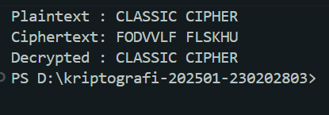
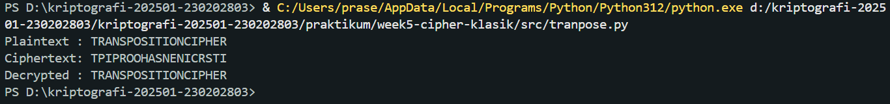
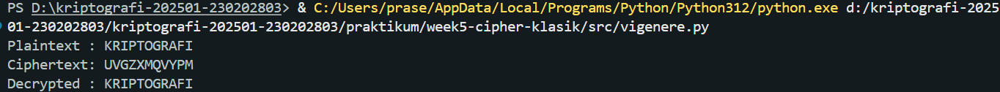

# Laporan Praktikum Kriptografi
Minggu ke-: 5
Topik: [Cipher Klasik (Caesar, Vigenère, Transposisi)]  
Nama: [Bagas Enggar Prasetyo]  
NIM: [230202803]  
Kelas: [5IKRB]  

---

## 1. Tujuan
- Menerapkan algoritma Caesar Cipher untuk enkripsi dan dekripsi teks.
- Menerapkan algoritma Vigenère Cipher dengan variasi kunci.
- Mengimplementasikan algoritma transposisi sederhana.
- Menjelaskan kelemahan algoritma kriptografi klasik.

---

## 2. Dasar Teori
Caesar Cipher adalah salah satu metode enkripsi tertua yang menggunakan pergeseran huruf dalam alfabet. Setiap huruf pada plaintext digantikan oleh huruf lain yang berada beberapa posisi setelahnya sesuai nilai shift (kunci). Misalnya, dengan shift 3, huruf A menjadi D, B menjadi E, dan seterusnya. Kelemahan cipher ini adalah mudah dipecahkan menggunakan analisis frekuensi karena pola kemunculan huruf tetap terlihat jelas.

Vigenere Cipher menggunakan kunci berupa kata atau frasa untuk menentukan pergeseran tiap huruf pada plaintext. Teknik ini lebih kuat dari Caesar Cipher karena pergeseran huruf berbeda-beda mengikuti panjang dan pola kunci. Jika kunci lebih panjang dan bersifat acak, cipher ini semakin sulit dipatahkan. Namun, bila panjang kunci berhasil ditebak, analisis frekuensi masih bisa digunakan untuk memecahkannya.

Algoritma Transposisi tidak mengganti huruf seperti dua cipher sebelumnya, melainkan mengubah posisi huruf dalam plaintext sesuai aturan tertentu. Contohnya adalah columnar transposition, di mana pesan ditulis dalam tabel berdasarkan lebar kunci, kemudian dibaca menurut urutan kolom yang telah ditentukan. Cipher ini menjaga frekuensi huruf, sehingga dapat rentan terhadap analisis pola, namun tetap memberikan keamanan tambahan jika dikombinasikan dengan metode substitusi.

Ringkasnya, cipher klasik memberikan dasar penting dalam kriptografi modern, meskipun secara mandiri sudah tidak aman untuk penggunaan modern karena mudah dipecahkan dengan teknik kriptoanalisis.

---

## 3. Alat dan Bahan
- Python 3.12  
- Visual Studio Code  
- Git dan akun GitHub

---

## 4. Langkah Percobaan

1. Membuat file `caesar.py` di folder `praktikum/week5-cipher-klasik/src/caesar.py`.
2. Membuat file `tranpose.py` di folder `praktikum/week5-cipher-klasik/src/tranpose.py`.
3. Membuat file `vigenere.py` di folder `praktikum/week5-cipher-klasik/src/vigenere.py`.
4. Menyalin kode program dari panduan praktikum.
5. Menjalankan semua program dari panduan praktikum
6. Menaruh hasil eksekusi dari program ke dalam folder `screenshots/`

---

## 5. Source Code

```python
def caesar_encrypt(plaintext, key):
    result = ""
    for char in plaintext:
        if char.isalpha():
            shift = 65 if char.isupper() else 97
            result += chr((ord(char) - shift + key) % 26 + shift)
        else:
            result += char
    return result

def caesar_decrypt(ciphertext, key):
    return caesar_encrypt(ciphertext, -key)

# Contoh uji
msg = "CLASSIC CIPHER"
key = 3
enc = caesar_encrypt(msg, key)
dec = caesar_decrypt(enc, key)
print("Plaintext :", msg)
print("Ciphertext:", enc)
print("Decrypted :", dec)
```

```python
def transpose_encrypt(plaintext, key=5):
    ciphertext = [''] * key
    for col in range(key):
        pointer = col
        while pointer < len(plaintext):
            ciphertext[col] += plaintext[pointer]
            pointer += key
    return ''.join(ciphertext)

def transpose_decrypt(ciphertext, key=5):
    num_of_cols = int(len(ciphertext) / key + 0.9999)
    num_of_rows = key
    num_of_shaded_boxes = (num_of_cols * num_of_rows) - len(ciphertext)
    plaintext = [''] * num_of_cols
    col = 0
    row = 0
    for symbol in ciphertext:
        plaintext[col] += symbol
        col += 1
        if (col == num_of_cols) or (col == num_of_cols - 1 and row >= num_of_rows - num_of_shaded_boxes):
            col = 0
            row += 1
    return ''.join(plaintext)

# Contoh uji
msg = "TRANSPOSITIONCIPHER"
enc = transpose_encrypt(msg, key=5)
dec = transpose_decrypt(enc, key=5)
print("Plaintext :", msg)
print("Ciphertext:", enc)
print("Decrypted :", dec)
```

```python
def vigenere_encrypt(plaintext, key):
    result = []
    key = key.lower()
    key_index = 0
    for char in plaintext:
        if char.isalpha():
            shift = ord(key[key_index % len(key)]) - 97
            base = 65 if char.isupper() else 97
            result.append(chr((ord(char) - base + shift) % 26 + base))
            key_index += 1
        else:
            result.append(char)
    return "".join(result)

def vigenere_decrypt(ciphertext, key):
    result = []
    key = key.lower()
    key_index = 0
    for char in ciphertext:
        if char.isalpha():
            shift = ord(key[key_index % len(key)]) - 97
            base = 65 if char.isupper() else 97
            result.append(chr((ord(char) - base - shift) % 26 + base))
            key_index += 1
        else:
            result.append(char)
    return "".join(result)

# Contoh uji
msg = "KRIPTOGRAFI"
key = "KEY"
enc = vigenere_encrypt(msg, key)
dec = vigenere_decrypt(enc, key)
print("Plaintext :", msg)
print("Ciphertext:", enc)
print("Decrypted :", dec)
```

---

## 6. Hasil dan Pembahasan

- Hasil eksekusi program `caesar.py` :



- Hasil eksekusi program `tranpose.py` :



- Hasil eksekusi program `vigenere.py` :




---

## 7. Jawaban Pertanyaan
`
- Pertanyaan 1: Kelemahan utama Caesar Cipher adalah ruang kunci yang sangat kecil dan pola pergeseran huruf yang tetap, sehingga sangat mudah dipecahkan dengan brute force atau analisis frekuensi. Sementara itu, Vigenère Cipher meskipun lebih kuat, tetap memiliki kelemahan jika panjang kuncinya diketahui atau jika kunci yang digunakan pendek dan berulang. Dalam kondisi tersebut, cipher ini masih bisa dipecahkan menggunakan metode seperti Kasiski examination atau Friedman test.

- Pertanyaan 2: Cipher klasik, terutama jenis substitusi, tetap mempertahankan pola kemunculan huruf dari bahasa aslinya. Setiap bahasa memiliki karakteristik frekuensi huruf tertentu (misalnya, huruf 'E' sering muncul dalam bahasa Inggris). Karena pola ini tidak tersamarkan, penyerang dapat menganalisis distribusi huruf pada ciphertext dan mencocokkannya dengan pola bahasa untuk memecahkan pesan.

- Pertanyaan 3: Cipher substitusi mengganti setiap huruf dengan huruf lain atau simbol, sehingga bentuk pesan berubah tetapi urutan huruf tetap sama. Kelebihannya sederhana dan cepat diterapkan; namun kelemahannya mudah diserang menggunakan analisis frekuensi karena distribusi huruf tidak berubah.

Cipher transposisi, sebaliknya, hanya mengacak posisi huruf tanpa mengubah simbolnya. Keuntungannya adalah pola huruf menjadi tidak berurutan sehingga sulit ditebak berdasarkan urutan kata. Namun, karena frekuensi huruf tetap sama, cipher ini tetap rentan jika tidak dipadukan dengan teknik lain. Pada praktiknya, kombinasi substitusi dan transposisi memberikan tingkat keamanan lebih baik dibanding digunakan sendiri-sendiri.


---

## 8. Kesimpulan
Secara keseluruhan, cipher klasik seperti Caesar, Vigenère, dan transposisi merupakan fondasi penting dalam perkembangan kriptografi. Meskipun sederhana dan mudah diterapkan, metode ini memiliki kelemahan mendasar karena masih mempertahankan pola bahasa asli, baik dalam bentuk distribusi huruf maupun struktur pesan. Hal tersebut membuatnya rentan terhadap teknik analisis frekuensi dan metode kriptoanalisis sederhana lainnya. Walaupun sudah tidak lagi digunakan untuk keamanan modern, konsep dasar dari cipher klasik tetap memberi pemahaman penting mengenai prinsip enkripsi dan menjadi dasar bagi algoritma kriptografi yang lebih kompleks dan aman saat ini.


---

## 9. Daftar Pustaka

---

## 10. Commit Log

```
commit week5-cipher-klasik
Author: Bagas Enggar Prasetyo <bagasenggarp42@gmail.com>
Date:   2025-11-03

    week5-cipher-klasik: (Caesar, Vigenère, Transposisi)
```
