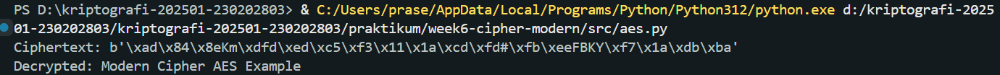
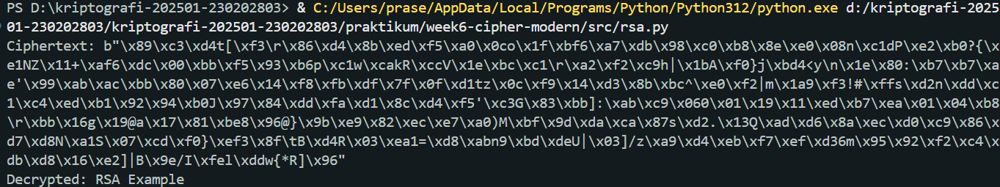
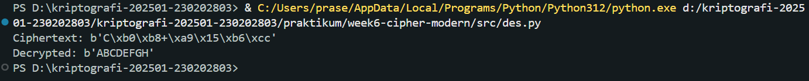

# Laporan Praktikum Kriptografi
Minggu ke-: 6
Topik: [Cipher Modern (DES, AES, RSA)]  
Nama: [Bagas Enggar Prasetyo]  
NIM: [NIM Mahasiswa]  
Kelas: [Kelas]  

---

## 1. Tujuan
- Mengimplementasikan algoritma DES untuk blok data sederhana.
- Menerapkan algoritma AES dengan panjang kunci 128 bit.
- Menjelaskan proses pembangkitan kunci publik dan privat pada algoritma RSA.

---

## 2. Dasar Teori
Cipher modern adalah sistem kriptografi yang digunakan untuk melindungi data digital dengan tingkat keamanan yang tinggi. Berbeda dengan cipher klasik yang bergantung pada substitusi dan transposisi sederhana, cipher modern menggunakan prinsip matematika kompleks, teori bilangan, dan operasi logika biner (seperti XOR, rotasi bit, dan permutasi). Cipher modern terbagi menjadi dua jenis utama:

- Cipher simetris (Symmetric Key Cipher) – menggunakan satu kunci yang sama untuk proses enkripsi dan dekripsi. Contohnya: DES dan AES.

- Cipher asimetris (Asymmetric Key Cipher) – menggunakan sepasang kunci berbeda, yaitu public key dan private key. Contohnya: RSA.

Cipher modern dirancang agar tahan terhadap berbagai serangan seperti analisis frekuensi, brute force, maupun serangan diferensial dan linear.

---

## 3. Alat dan Bahan
- Python 3.12
- Visual Studio Code / editor lain  
- Git dan akun GitHub  
- Library tambahan pycryptodome

---

## 4. Langkah Percobaan

1. Membuat file `aes.py` di folder `praktikum/week6-cipher-modern/src/aes.py`.
2. Membuat file `rsa.py` di folder `praktikum/week6-cipher-modern/src/rsa.py`.
3. Membuat file `des.py` di folder `praktikum/week6-cipher-modern/src/des.py`.
4. Menyalin kode program dari panduan praktikum.
5. Menginstall library tambahan pycryptodome.
6. Menjalankan program dengan perintah `python aes.py`.
7. Menjalankan program dengan perintah `python rsa.py`.
8. Menjalankan program dengan perintah `python des.py`.
9. Menaruh hasil eksekusi dari program ke dalam folder `screenshots/`

---

## 5. Source Code

```python AES
from Crypto.Cipher import AES
from Crypto.Random import get_random_bytes

key = get_random_bytes(16)  # 128 bit key
cipher = AES.new(key, AES.MODE_EAX)

plaintext = b"Modern Cipher AES Example"
ciphertext, tag = cipher.encrypt_and_digest(plaintext)

print("Ciphertext:", ciphertext)

# Dekripsi
cipher_dec = AES.new(key, AES.MODE_EAX, nonce=cipher.nonce)
decrypted = cipher_dec.decrypt(ciphertext)
print("Decrypted:", decrypted.decode())
```

```python RSA
from Crypto.PublicKey import RSA
from Crypto.Cipher import PKCS1_OAEP

# Generate key pair
key = RSA.generate(2048)
private_key = key
public_key = key.publickey()

# Enkripsi dengan public key
cipher_rsa = PKCS1_OAEP.new(public_key)
plaintext = b"RSA Example"
ciphertext = cipher_rsa.encrypt(plaintext)
print("Ciphertext:", ciphertext)

# Dekripsi dengan private key
decipher_rsa = PKCS1_OAEP.new(private_key)
decrypted = decipher_rsa.decrypt(ciphertext)
print("Decrypted:", decrypted.decode())
```

```python DES
from Crypto.Cipher import DES
from Crypto.Random import get_random_bytes

key = get_random_bytes(8)  # kunci 64 bit (8 byte)
cipher = DES.new(key, DES.MODE_ECB)

plaintext = b"ABCDEFGH"
ciphertext = cipher.encrypt(plaintext)
print("Ciphertext:", ciphertext)

decipher = DES.new(key, DES.MODE_ECB)
decrypted = decipher.decrypt(ciphertext)
print("Decrypted:", decrypted)
```


---

## 6. Hasil dan Pembahasan
 

Hasil eksekusi program cipher modern:






---

## 7. Jawaban Pertanyaan
 
- Pertanyaan 1:  

1. DES (Data Encryption Standard) dan AES (Advanced Encryption Standard) adalah algoritma simetris, artinya menggunakan satu kunci yang sama untuk proses enkripsi dan dekripsi. DES memiliki kunci sepanjang 56-bit, yang kini dianggap lemah karena dapat diretas dengan brute force dalam waktu singkat. AES menggunakan panjang kunci 128, 192, atau 256-bit, memberikan keamanan jauh lebih kuat terhadap serangan brute force dan analisis kriptografi modern.
2. RSA, sebaliknya, adalah algoritma asimetris yang menggunakan dua kunci berbeda: public key untuk enkripsi dan private key untuk dekripsi. Keamanannya tidak bergantung pada panjang kunci biner, melainkan pada kesulitan memfaktorkan bilangan prima besar. RSA umumnya menggunakan kunci minimal 2048-bit untuk mencapai tingkat keamanan yang setara dengan AES 128-bit.

- Pertanyaan 2: 

1. Keamanan lebih tinggi: Panjang kunci DES (56-bit) terlalu pendek untuk standar keamanan saat ini, sedangkan AES mendukung hingga 256-bit yang sangat sulit diretas.
2. Efisiensi dan kecepatan: AES dirancang agar efisien pada perangkat keras maupun perangkat lunak, sehingga cocok untuk enkripsi data besar dan real-time seperti komunikasi internet, penyimpanan cloud, atau perangkat mobile.
3. Standar internasional: AES diadopsi oleh NIST (National Institute of Standards and Technology) sejak tahun 2001 sebagai pengganti resmi DES dan menjadi standar enkripsi global.
4. Struktur modern: AES menggunakan Substitution-Permutation Network (SPN) yang lebih kompleks dibanding Feistel Network milik DES, membuatnya lebih tahan terhadap berbagai jenis serangan kriptanalisis.

- Pertanyaan 3: 

RSA dikategorikan sebagai asimetris karena menggunakan dua kunci berbeda namun saling berhubungan secara matematis:
1. Public key (terbuka) digunakan untuk mengenkripsi pesan.
2. Private key (rahasia) digunakan untuk mendekripsi pesan.
Tidak seperti algoritma simetris, pengirim dan penerima tidak perlu berbagi satu kunci yang sama, sehingga lebih aman dalam komunikasi publik.
3. Keamanan RSA bergantung pada kesulitan memfaktorkan n menjadi p dan q, yang secara praktis sangat sulit dilakukan jika bilangan prima yang dipilih cukup besar (misalnya lebih dari 1024-bit).

---

## 8. Kesimpulan

Cipher modern merupakan fondasi utama dalam menjaga kerahasiaan dan keamanan data di era digital. Berbeda dengan cipher klasik yang mudah diserang melalui analisis pola, cipher modern menggunakan prinsip matematis kompleks, operasi logika biner, dan teori bilangan untuk menghasilkan sistem enkripsi yang jauh lebih kuat.

Algoritma seperti DES, AES, dan RSA menjadi contoh penting dalam perkembangan teknologi kriptografi. DES berperan sebagai tonggak awal cipher blok, namun kini dianggap lemah karena panjang kunci yang pendek. AES hadir sebagai penerus dengan struktur yang lebih efisien dan tingkat keamanan tinggi, menjadikannya standar global dalam enkripsi data simetris. Sementara itu, RSA memperkenalkan konsep kunci publik dan privat, memungkinkan komunikasi aman tanpa perlu berbagi kunci rahasia secara langsung.

Secara keseluruhan, cipher modern telah membawa keamanan informasi ke tingkat yang lebih maju dengan menggabungkan kekuatan matematika, kecepatan komputasi, dan strategi kriptografi yang adaptif terhadap ancaman digital masa kini.


---

## 9. Daftar Pustaka

---

## 10. Commit Log

```
commit week6-cipher-modern
Author: Bagas Enggar Prasetyo <bagasenggarp42@gmail.com>
Date:   2025-11-10

    week6-cipher-modern: DES, AES, RSA
```
